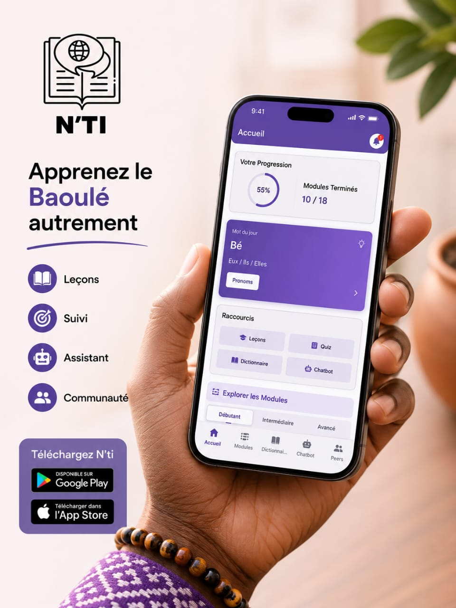

# N'TI — Application d'apprentissage du baoulé

N'TI est une application Flutter conçue pour aider les apprenants à découvrir et pratiquer la langue baoulé.

> Le projet regroupe un système de leçons, un dictionnaire, un assistant IA conversationnel, un espace communautaire et un suivi de progression.

---

## Fonctionnalités principales

- **Authentification et onboarding** : inscription, connexion et tableau de bord personnalisé.
- **Modules de leçons** : parcours pédagogiques thématiques avec suivi des progrès.
- **Dictionnaire** : recherche Baoulé ↔︎ Français et consultation de définitions.
- **Chatbot IA** : assistant conversationnel « N’ti » pour aider à apprendre le vocabulaire, la grammaire et la culture.
- **Peer-to-peer** : appels vidéo pour pratiquer avec d'autres apprenants.
- **Profil utilisateur** : données personnelles, niveau et statut de présence en ligne.
- **Notifications d’événements** : gestion et affichage d’événements culturels ou pédagogiques.

---

## Technologies utilisées


---

## Architecture technique

- **Frontend** : Flutter + Material Design
- **Backend** : Firebase
  - `Firebase Auth` pour l’authentification
  - `Cloud Firestore` pour les données d’utilisateurs, les messages, les leçons et les événements
- **State management** : `provider`
- **Navigation** : `go_router`
- **IA** : intégration de Gemini via `google_generative_ai` et `firebase_ai`
- **WebRTC** : `flutter_webrtc` pour les appels vidéo

---

## Arborescence importante

- `lib/main.dart` : point d’entrée de l’application
- `lib/providers/` : gestion des états et de l’authentification
- `lib/screens/` : écrans de l’application
- `lib/services/` : logique métier et communication avec Firebase / IA
- `lib/models/` : structures de données
- `lib/theme/` : thèmes et styles
- `assets/images/` : ressources visuelles

---

## Installation et configuration

### Prérequis

- Flutter SDK installé (version compatible avec Dart >= 3.9)
- Android Studio ou VS Code
- Un compte Firebase

### Étapes pour démarrer

1. Clonez le dépôt :

```sh
git clone https://github.com/5yn0r/KOY_ORIGINE_PROJET_APP_NTI.git
cd KOY_ORIGINE_PROJET_APP_NTI
```

2. Installez les dépendances :

```sh
flutter pub get
```

3. Configurez Firebase :

- Créez un projet Firebase.
- Ajoutez une application Android.
- Téléchargez `google-services.json` et placez-le dans `android/app/`.
- Si vous ajoutez iOS, placez `GoogleService-Info.plist` dans `ios/Runner/`.

4. Lancez l’application :

```sh
flutter run
```
---

## Exécution pour l'évaluation

- Pour tester en local : `flutter run`
- Pour construire l'APK Android : `flutter build apk --release`
- Pour tester sur le web : `flutter run -d chrome`

---



## Licence

Ce projet est distribué sous la licence MIT. Voir `LICENSE`.
